# 🎬 Scalable Media Transcoding Service


A distributed, event-driven architecture for high-performance video processing. This project solves the "Blocking Event Loop" problem in Node.js by offloading CPU-intensive tasks (FFmpeg transcoding) to a background worker. The entire system is containerized and orchestrated via Docker Compose.

---

## 🏗 System Architecture

The system uses a **Producer-Consumer** pattern to handle heavy computational tasks without blocking the main API.

```mermaid
sequenceDiagram
    participant User as 👤 User (Frontend)
    participant API as ⚙️ API (NestJS)
    participant Queue as 📨 Queue (Redis)
    participant Worker as 👷 Worker (Processor)
    
    User->>API: Upload Video (POST /transcode)
    API->>Disk: Save Raw File
    API->>Queue: Add Job { fileName: "video.mp4" }
    API-->>User: 201 Created (Returns Job ID)
    
    Note right of API: API is now free to handle other requests!
    
    Loop Every 2s
        User->>API: Check Status (GET /status/:id)
        API-->>User: { status: "active" }
    end
    
    Queue->>Worker: Process Job
    Worker->>Worker: FFmpeg Transcoding...
    Worker-->>Queue: Job Completed
    
    User->>API: Check Status
    API-->>User: { status: "completed", url: "/download.mp3" }
    User->>API: Download Audio
```



### Key Features

- **🚀 Asynchronous Processing**: Decouples the HTTP Request lifecycle from execution logic.
- **🛡 High Availability**: Uses BullMQ (Redis) to persist jobs, ensuring data integrity even if the worker crashes.
- **📈 Microservices-Ready**: Worker runs in a separate container, allowing horizontal scaling.
- **🔄 Fault Tolerance**: Automatic retries and exponential backoff for failed jobs.
- **⚡ Real-time Feedback**: Client-side polling for live status updates.

---

## 🛠 Tech Stack

| Component | Technology | Description |
| :--- | :--- | :--- |
| **Monorepo** | Docker Compose | Managed structure with backend and frontend separation. |
| **Backend** | NestJS | Node.js framework for building efficient, scalable server-side applications. |
| **Frontend** | Next.js 14 | React framework with Tailwind CSS for a modern UI. |
| **Queue** | Redis + BullMQ | In-memory data structure store used as a message broker. |
| **Processing** | FFmpeg | A complete, cross-platform solution to record, convert and stream audio and video. |

---

## 📂 Project Structure

```bash
transcode-service/
├── backend/            # NestJS Application (API & Worker)
│   ├── src/
│   │   ├── app.controller.ts   # API Endpoints
│   │   ├── app.service.ts      # Business Logic
│   │   └── transcode.consumer.ts # Background Worker Logic
│   └── Dockerfile
├── frontend/           # Next.js Application
│   ├── src/app/        # App Router Pages
│   └── Dockerfile
├── uploads/            # Shared volume for media files (Host <-> Container)
├── docker-compose.yml  # Orchestration config
└── README.md
```

---

## 🏃‍♂️ Getting Started

The entire system is containerized. You can spin up the Frontend, API, Worker, and Redis with a single command.

### Prerequisites

- **Docker Desktop** installed and running.

### Installation

1.  **Clone the repository:**
    ```bash
    git clone https://github.com/YOUR_USERNAME/transcode-service.git
    cd transcode-service
    ```

2.  **Start the services:**
    ```bash
    docker-compose up --build
    ```
    *This will build the Node.js images, install FFmpeg, and start all 4 containers.*

3.  **Access the application:**
    - **Frontend**: [http://localhost:3001](http://localhost:3001)
    - **API**: [http://localhost:3000](http://localhost:3000)

### Stopping the Services

To stop the containers and remove the networks:
```bash
docker-compose down
```

---

## 🔌 API Documentation

| Method | Endpoint | Body | Description |
| :--- | :--- | :--- | :--- |
| `POST` | `/transcode` | `file: (binary)` | Uploads a video file and adds a job to the queue. Returns a Job ID. |
| `GET` | `/transcode/status/:id` | - | Checks the status of a specific job (`waiting`, `active`, `completed`, `failed`). |

---

## 🧠 Engineering Decisions

### Why Queue vs. Direct Processing?
Video transcoding is **CPU-bound**. Running it directly in the Controller would block the Node.js Event Loop, making the API unresponsive for all other users. A queue isolates the heavy lifting to a background process.

### Why Docker Compose?
To simulate a production environment where the API, Worker, and Database run on separate instances. This ensures environmental consistency between development and production and simplifies the "works on my machine" problem.

---

## 🔮 Future Improvements

- [ ] **Cloud Storage**: Replace local disk storage with AWS S3 for scalability.
- [ ] **WebSockets**: Implement push-based real-time notifications instead of polling.
- [ ] **Notifications**: Add email/SMS notification upon job completion.
- [ ] **Formats**: Support multiple output formats (HLS, DASH) for adaptive streaming.

---

## 👤 Author

**Ayush Vyas**

- Github: [@ayushvyas](https://github.com/ayushvyas)